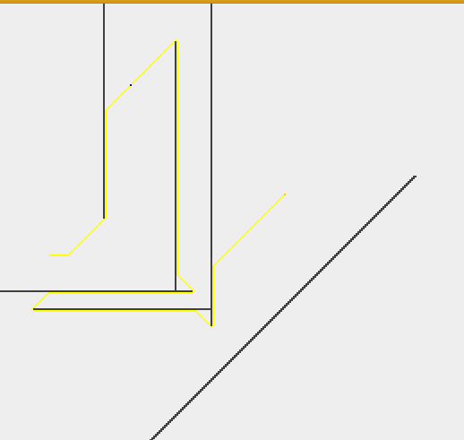

A Star寻路算法的可视化实现
===================================
使用Java Swing
----------------------------------- 
### v0.1.0  
### author by So Aanyip

这是使用java编写的A Star寻路算法的可视化实现，用户可以通过右键点击来使图中的点自动寻找最短路径进行移动，或者使用左键拖动划线来生成障碍物。

 example 

Main方法在AstarFrame2中。

	
